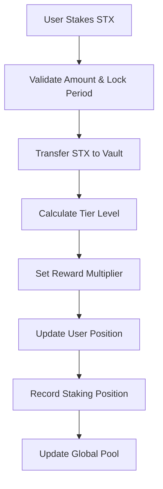
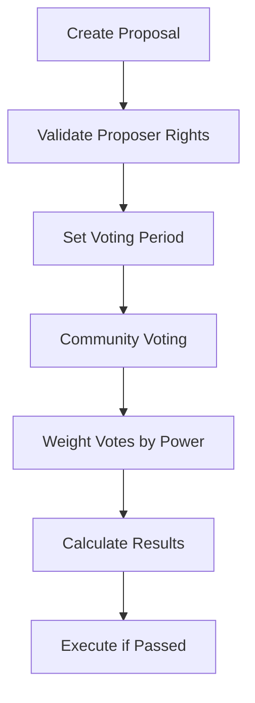

# BitFlow Vault Protocol (BVP)

[](https://clarity-lang.org/)
[](https://stacks.co/)
[](LICENSE)

> Revolutionary Bitcoin-native DeFi protocol combining liquid staking, algorithmic governance, and yield optimization on the Stacks blockchain.

## 🌟 Overview

BitFlow Vault Protocol (BVP) is a next-generation DeFi infrastructure that transforms traditional staking into a dynamic, self-adjusting ecosystem. Built on Stacks, it leverages Bitcoin's security while providing advanced DeFi features including liquid staking, tiered rewards, and decentralized governance.

### Key Features

- **🔐 Liquid Staking Vault**: Stake STX while maintaining liquidity through synthetic derivatives
- **🏛️ Algorithmic Governance**: AI-powered proposal scoring with community-driven consensus mechanisms  
- **⚡ Dynamic Yield Engine**: Real-time reward optimization based on market conditions and stake duration
- **🛡️ Multi-Layer Security**: Bitcoin finality with Clarity-native safety checks and emergency protocols
- **🌉 Cross-Chain Ready**: Built-in infrastructure for future Bitcoin L2 interoperability
- **🔍 Zero-Knowledge Proofs**: Privacy-preserving analytics while maintaining full audit transparency

## 🏗️ Architecture

### System Overview

```
┌─────────────────────────────────────────────────────────────────┐
│                    BitFlow Vault Protocol                      │
├─────────────────────────────────────────────────────────────────┤
│  ┌─────────────┐ ┌─────────────┐ ┌─────────────┐ ┌──────────┐  │
│  │ Vault Core  │ │ Governance  │ │ Liquidity   │ │   Risk   │  │
│  │   Engine    │ │   Oracle    │ │ Pool Mgr.   │ │Assessment│  │
│  └─────────────┘ └─────────────┘ └─────────────┘ └──────────┘  │
│                                                                 │
│  ┌─────────────┐ ┌─────────────┐ ┌─────────────┐ ┌──────────┐  │
│  │ Staking     │ │ Tier System │ │ Emergency   │ │ Rewards  │  │
│  │ Positions   │ │ Management  │ │ Response    │ │ Engine   │  │
│  └─────────────┘ └─────────────┘ └─────────────┘ └──────────┘  │
└─────────────────────────────────────────────────────────────────┘
```

### Contract Architecture

#### Core Components

1. **Vault Core Engine**
   - Advanced staking mechanics with time-weighted reward calculations
   - Multi-tier reward system based on stake commitment
   - Flexible lock periods with loyalty bonuses

2. **Governance Oracle**
   - Decentralized decision-making with reputation-based voting weights
   - Weighted voting system based on staking positions
   - Democratic proposal creation and execution

3. **Liquidity Pool Manager**
   - Automated market makers for synthetic token pairs
   - Dynamic liquidity provision mechanisms
   - Cross-chain bridge readiness

4. **Risk Assessment Module**
   - Real-time health factor monitoring
   - Liquidation protection mechanisms
   - Portfolio risk analytics

5. **Emergency Response System**
   - Circuit breakers and failsafe mechanisms
   - Protocol pause/resume functionality
   - Maximum security guarantees

## 🎯 Data Flow

### Staking Flow



### Governance Flow



## 🏆 Tier System

| Tier | Minimum Stake | Reward Multiplier | Features |
|------|---------------|-------------------|----------|
| **Silver** | 1 STX | 1x | Basic staking |
| **Gold** | 5 STX | 1.5x | Enhanced rewards + Governance |
| **Diamond** | 10 STX | 2x | Premium rewards + All features |

### Lock Period Bonuses

| Lock Period | Bonus Multiplier | Description |
|-------------|------------------|-------------|
| Flexible | 1x | No lock commitment |
| 30 days | 1.25x | Medium-term commitment |
| 60 days | 1.5x | Long-term loyalty bonus |

## 🚀 Getting Started

### Prerequisites

- [Clarinet](https://github.com/hirosystems/clarinet) installed
- [Stacks CLI](https://docs.stacks.co/references/stacks-cli) configured
- Node.js 16+ for testing

### Installation

1. Clone the repository:

```bash
git clone https://github.com/josh-joel/bitflow-vault.git
cd bitflow-vault
```

2. Install dependencies:

```bash
npm install
```

3. Initialize Clarinet project:

```bash
clarinet check
```

### Testing

Run the test suite:

```bash
npm test
```

Check contract syntax:

```bash
clarinet check
```

## 📝 Smart Contract Interface

### Public Functions

#### Core Staking Functions

```clarity
;; Initialize the protocol with tier configurations
(define-public (initialize-contract) ...)

;; Stake STX with optional lock period
(define-public (stake-stx (amount uint) (lock-period uint)) ...)

;; Begin unstaking process with security cooldown
(define-public (initiate-unstake (amount uint)) ...)

;; Complete unstaking after cooldown period
(define-public (complete-unstake) ...)
```

#### Governance Functions

```clarity
;; Create a new governance proposal
(define-public (create-proposal 
  (description (string-utf8 256)) 
  (voting-period uint)) ...)

;; Vote on an active proposal
(define-public (vote-on-proposal 
  (proposal-id uint) 
  (vote-for bool)) ...)
```

#### Administrative Functions

```clarity
;; Emergency protocol pause
(define-public (pause-contract) ...)

;; Resume protocol operations
(define-public (resume-contract) ...)
```

### Read-Only Functions

```clarity
;; Get contract owner
(define-read-only (get-contract-owner) ...)

;; Get total STX in pool
(define-read-only (get-stx-pool) ...)

;; Get total proposal count
(define-read-only (get-proposal-count) ...)
```

## 🔧 Configuration

### Protocol Parameters

| Parameter | Default Value | Description |
|-----------|---------------|-------------|
| `base-reward-rate` | 500 (5%) | Annual base yield rate |
| `bonus-rate` | 100 (1%) | Loyalty bonus for extended staking |
| `minimum-stake` | 1,000,000 μSTX | Minimum stake amount (1 STX) |
| `cooldown-period` | 1,440 blocks | Security cooldown (~24 hours) |

### Error Codes

| Code | Constant | Description |
|------|----------|-------------|
| 1000 | `ERR-NOT-AUTHORIZED` | Insufficient permissions |
| 1001 | `ERR-INVALID-PROTOCOL` | Protocol validation failed |
| 1002 | `ERR-INVALID-AMOUNT` | Invalid amount specified |
| 1003 | `ERR-INSUFFICIENT-STX` | Insufficient STX balance |
| 1004 | `ERR-COOLDOWN-ACTIVE` | Cooldown period active |
| 1005 | `ERR-NO-STAKE` | No staking position found |
| 1006 | `ERR-BELOW-MINIMUM` | Below minimum stake threshold |
| 1007 | `ERR-PAUSED` | Protocol is paused |

## 🛡️ Security Features

- **Multi-signature governance**: Requires weighted community consensus
- **Time-locked operations**: Security cooldowns for sensitive operations
- **Emergency controls**: Circuit breakers and pause mechanisms
- **Input validation**: Comprehensive parameter validation
- **Overflow protection**: Safe arithmetic operations
- **Access controls**: Role-based permission system

## 🔮 Roadmap

### Phase 1: Core Protocol ✅

- [x] Basic staking mechanism
- [x] Tier system implementation
- [x] Governance framework
- [x] Security controls

### Phase 2: Advanced Features 🚧

- [ ] Liquid staking derivatives
- [ ] Cross-chain bridge integration
- [ ] Advanced yield strategies
- [ ] Zero-knowledge analytics

### Phase 3: Ecosystem Expansion 📋

- [ ] Third-party integrations
- [ ] Mobile wallet support
- [ ] Institutional features
- [ ] Layer 2 compatibility

## 🤝 Contributing

We welcome contributions! Please see our [Contributing Guidelines](CONTRIBUTING.md) for details.

1. Fork the repository
2. Create your feature branch (`git checkout -b feature/amazing-feature`)
3. Commit your changes (`git commit -m 'Add amazing feature'`)
4. Push to the branch (`git push origin feature/amazing-feature`)
5. Open a Pull Request

## 📄 License

This project is licensed under the MIT License - see the [LICENSE](LICENSE) file for details.
